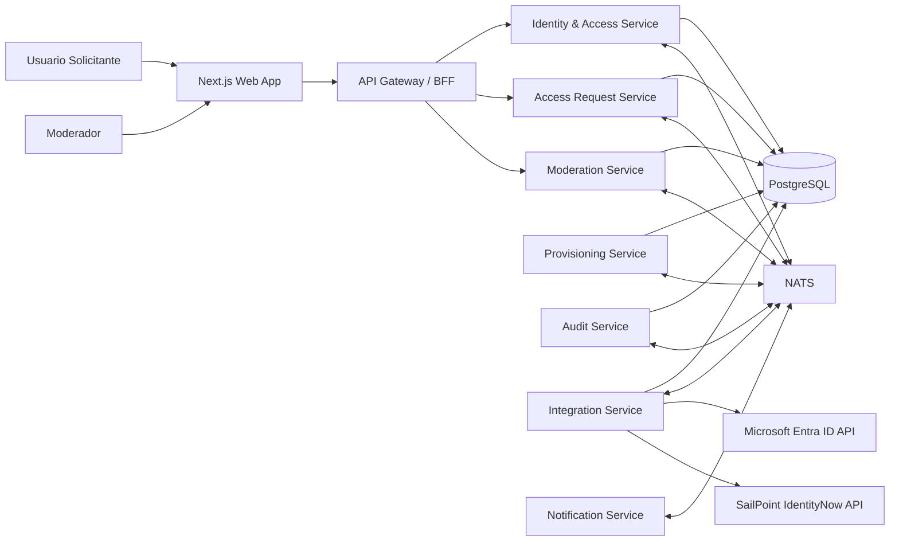
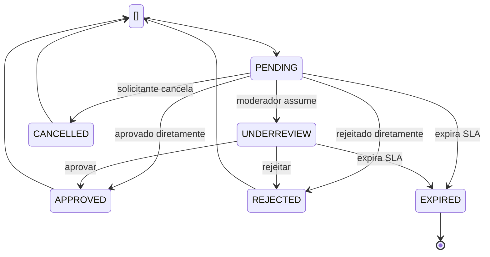
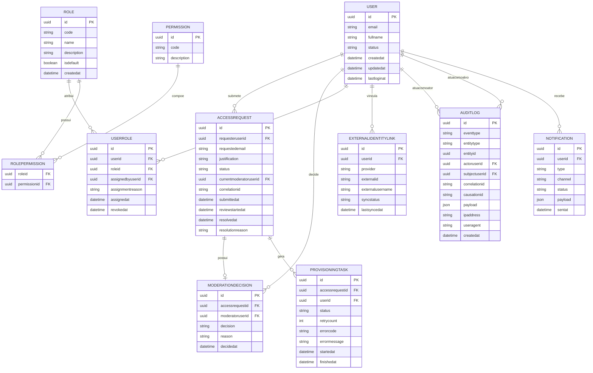
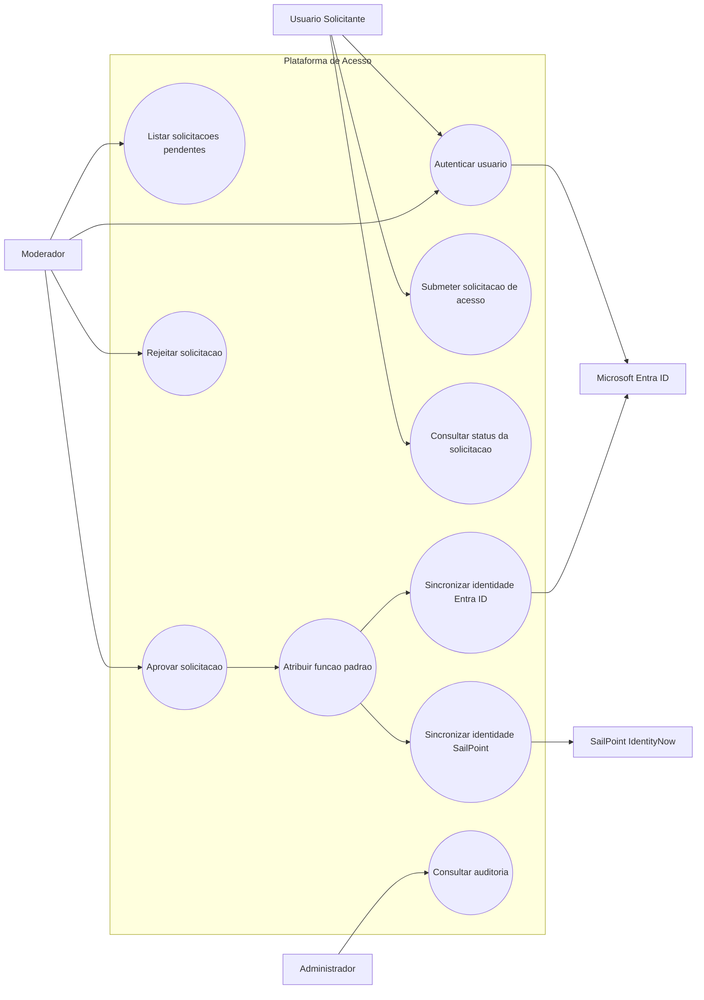
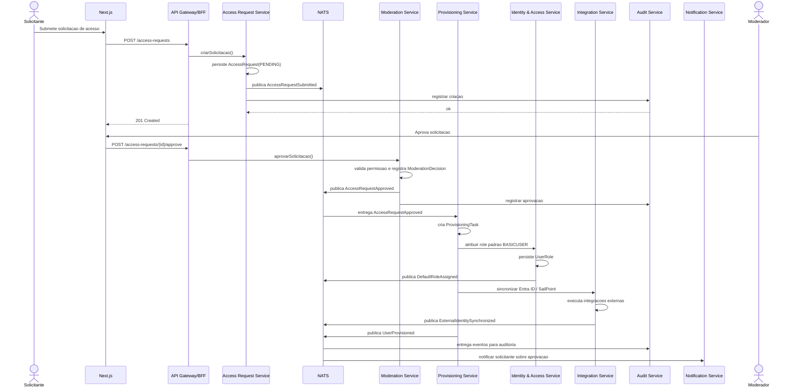
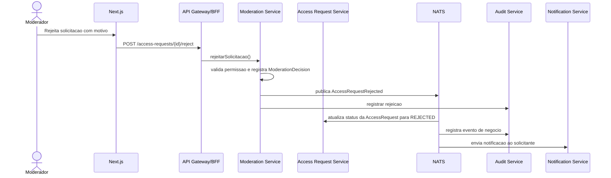

# Avaliação Técnica | Suzano/Thera Consulting

Aqui encontra-se redigida a modelagem da solução de software em núvem que visa servir uma plataforma de gestão moderada de acessos de usuários, integrada às plataformas Microsoft Entra ID e SailPoint IdentityNow.

Todos os aspectos arquitetônicos e de casos de uso, à luz da especificação das condições de fronteiras iniciais, informados neste [documento](https://tinyurl.com/79m42e8r), serão explorados em diferentes seções deste documento.

## Índice de conteúdo

<!-- TOC -->

- [Avaliação Técnica | Suzano/Thera Consulting](#avalia%C3%A7%C3%A3o-t%C3%A9cnica--suzanothera-consulting)
    - [Índice de conteúdo](#%C3%ADndice-de-conte%C3%BAdo)
    - [Introdução](#introdu%C3%A7%C3%A3o)
    - [Responsável técnico](#respons%C3%A1vel-t%C3%A9cnico)
- [Visão Geral da Arquitetura](#vis%C3%A3o-geral-da-arquitetura)
    - [Introdução](#introdu%C3%A7%C3%A3o)
        - [Princípios adotados](#princ%C3%ADpios-adotados)
        - [Componentes principais](#componentes-principais)
    - [Diagrama da arquitetura](#diagrama-da-arquitetura)
- [Bounded Contexts e Serviços](#bounded-contexts-e-servi%C3%A7os)
    - [Especificações do escopos](#especifica%C3%A7%C3%B5es-do-escopos)
- [Fluxo de Negócio](#fluxo-de-neg%C3%B3cio)
    - [Introdução](#introdu%C3%A7%C3%A3o)
    - [Fluxo principal de aprovação](#fluxo-principal-de-aprova%C3%A7%C3%A3o)
    - [Fluxo principal de rejeição](#fluxo-principal-de-rejei%C3%A7%C3%A3o)
    - [Eventos de domínio sugeridos](#eventos-de-dom%C3%ADnio-sugeridos)
        - [Exemplo de payload de evento](#exemplo-de-payload-de-evento)
    - [Estratégias importantes para consistência](#estrat%C3%A9gias-importantes-para-consist%C3%AAncia)
        - [Outbox Pattern](#outbox-pattern)
        - [Idempotência](#idempot%C3%AAncia)
        - [Sagas / Process Manager](#sagas--process-manager)
    - [Modelo de autenticação e autorização](#modelo-de-autentica%C3%A7%C3%A3o-e-autoriza%C3%A7%C3%A3o)
        - [OAuth2 + JWT](#oauth2--jwt)
        - [Claims recomendadas](#claims-recomendadas)
        - [Permissões mínimas sugeridas](#permiss%C3%B5es-m%C3%ADnimas-sugeridas)
    - [Considerações sobre fluxos de eventos](#considera%C3%A7%C3%B5es-sobre-fluxos-de-eventos)
        - [Eventos assíncronos](#eventos-ass%C3%ADncronos)
        - [Estados da solicitação](#estados-da-solicita%C3%A7%C3%A3o)
        - [Eventos de domínio internos](#eventos-de-dom%C3%ADnio-internos)
        - [Eventos de integração](#eventos-de-integra%C3%A7%C3%A3o)
- [Entidades de Domínio](#entidades-de-dom%C3%ADnio)
    - [Detalhamento](#detalhamento)
    - [Modelo entidade-relacionamento](#modelo-entidade-relacionamento)
        - [ER lógico sugerido](#er-l%C3%B3gico-sugerido)
- [Regras de Negócio](#regras-de-neg%C3%B3cio)
    - [Regras de negócio essenciais](#regras-de-neg%C3%B3cio-essenciais)
        - [Regras de solicitação](#regras-de-solicita%C3%A7%C3%A3o)
        - [Regras de moderação](#regras-de-modera%C3%A7%C3%A3o)
        - [Regras de provisionamento](#regras-de-provisionamento)
        - [Regras de auditoria](#regras-de-auditoria)
    - [Casos de uso](#casos-de-uso)
        - [Principais casos de uso do sistema](#principais-casos-de-uso-do-sistema)
        - [Diagrama de casos de uso](#diagrama-de-casos-de-uso)
    - [Diagramas de sequência](#diagramas-de-sequ%C3%AAncia)
        - [Aprovação da solicitação](#aprova%C3%A7%C3%A3o-da-solicita%C3%A7%C3%A3o)
        - [Rejeição da solicitação](#rejei%C3%A7%C3%A3o-da-solicita%C3%A7%C3%A3o)
- [Aspectos de segurança](#aspectos-de-seguran%C3%A7a)
    - [Introdução](#introdu%C3%A7%C3%A3o)
        - [Riscos associados à camada de autenticação e autorização](#riscos-associados-%C3%A0-camada-de-autentica%C3%A7%C3%A3o-e-autoriza%C3%A7%C3%A3o)
            - [Camada de autenticação e OAuth2 / Entra ID](#camada-de-autentica%C3%A7%C3%A3o-e-oauth2--entra-id)
            - [Camada de autorização e uso do JWT](#camada-de-autoriza%C3%A7%C3%A3o-e-uso-do-jwt)
        - [Riscos associados ao modelo de papéis e permissões](#riscos-associados-ao-modelo-de-pap%C3%A9is-e-permiss%C3%B5es)
            - [Camada de moderação de requisições de acessos](#camada-de-modera%C3%A7%C3%A3o-de-requisi%C3%A7%C3%B5es-de-acessos)
            - [Provisionamento automático de identidade papéis e permissões](#provisionamento-autom%C3%A1tico-de-identidade-pap%C3%A9is-e-permiss%C3%B5es)
        - [Riscos associados à integrações com serviços externos](#riscos-associados-%C3%A0-integra%C3%A7%C3%B5es-com-servi%C3%A7os-externos)
            - [Integrações externas Sailpoint & Entra ID](#integra%C3%A7%C3%B5es-externas-sailpoint--entra-id)
        - [Riscos associados à camada de persistência de dados DB relacional](#riscos-associados-%C3%A0-camada-de-persist%C3%AAncia-de-dados-db-relacional)
        - [Riscos associados ao mecanismo de auditoria logging de eventos](#riscos-associados-ao-mecanismo-de-auditoria-logging-de-eventos)
        - [Riscos de natureza genérica](#riscos-de-natureza-gen%C3%A9rica)
- [Aspectos de Escalabilidade](#aspectos-de-escalabilidade)
    - [Preliminares](#preliminares)
    - [Cenário](#cen%C3%A1rio)
    - [Objetivos de escalabilidade](#objetivos-de-escalabilidade)
    - [Arquitetura](#arquitetura)
        - [Componentes-chave a serem escalados por camada](#componentes-chave-a-serem-escalados-por-camada)
            - [NATS JetStream não "plain NATS":](#nats-jetstream-n%C3%A3o-plain-nats)
            - [Backend NestJS Autoscaled:](#backend-nestjs-autoscaled)
            - [PostgreSQL:](#postgresql)
            - [Redis como cache + armazenamento de sessão:](#redis-como-cache--armazenamento-de-sess%C3%A3o)
    - [Mecanismos de escalabilidade](#mecanismos-de-escalabilidade)
    - [Fluxo de requisição do usuário otimizado para escalabilidade](#fluxo-de-requisi%C3%A7%C3%A3o-do-usu%C3%A1rio-otimizado-para-escalabilidade)
    - [Monitoramento, observabilidade e alta disponibilidade](#monitoramento-observabilidade-e-alta-disponibilidade)
    - [Cronograma de implementação](#cronograma-de-implementa%C3%A7%C3%A3o)
    - [Custos](#custos)
    - [O que deseja fazer?](#o-que-deseja-fazer)

<!-- /TOC -->

##  Introdução

Como já supracitado, este sistema tem como função principal moderar a requisição de acessos para novos usuários, em um contexto corporativo e.g. à suite de ferramentas de software de uma empresa, através de um processo de moderação, a priori, por usuários já existentes (cadastrados) na base de dados do sistema e que possuem privilégios necessários para tal. De modo também à gerenciar a camada de autenticação e autenticação de novos usuários, existirão integrações desta plataforma às seguintes soluções:

- [Microsoft Entra ID](https://learn.microsoft.com/en-us/entra/identity/): Será responsável por lidar com a camada de autenticação, isto é sob o esquema OAuth2, i.e. 
- [SailPoint IdentityNow](https://documentation.sailpoint.com/): Considerando que a criação de identidades será feita pelo Entra ID, a **governança** por outro lado será feita via interface do IdentityNow.

Com efeito, serão exploradas as diferentes nuances de modelagem desse sistema, consolidadas em uma proposta de arquitetura orientada a eventos para esse cenário, com foco em:

- Solicitação de acesso feita por um usuário externo/candidato;
- Moderação por um usuário com permissão de moderador;
- Provisionamento automático de função padrão após aprovação;
- Integração com Microsoft Entra ID e SailPoint IdentityNow;
- Autenticação/autorização com OAuth2 + JWT;
- Auditabilidade ponta a ponta com trilha de logs e usuários envolvidos.

A estrutura dessa proposta será segmentada em diferentes seções:

- [Visão da arquitetura](#visão-geral-da-arquitetura);
- [Bounded contexts e serviços](#bounded-contexts-e-serviços);
- [Fluxo de negócio](#fluxo-de-negócio);
- [Entidades de domínio](#entidades-de-domínio);
- [Casos de uso](#casos-de-uso);
- [Análise de riscos](#aspectos-de-segurança);
- [Aspectos de escalabilidade](#aspectos-de-escalabilidade).

De posse de todo esse esquadrinhamento, as fases seguintes naturais, as quais não serão comtempladas nesse material, seriam:

- Definição de uma estrutura lógico-organizacional para implementar a base de código, i.e. padrão de projeto (_design pattern_);
- Escolha da(s) linguagem(ns) de programação e dos SDKs necessários para a implementação das camadas de abstração inerentes ao padrão de projeto escolhido e também para os diferentes tipos de integração com serviços e interfaces externos.

## Responsável técnico

Qualquer dúvida ou sugestão pode ser comunicada à Guilherme Lima Gonçalves. Os meios pelos quais isso pode ser feito são:

- Email: [lwglguilherme@gmail.com](mailto:lwglguilherme@gmail.com)
- Telefone: +55 51 9 8199 9952 ([WhatsApp](https://wa.me/5551981999952) | [Telegram](https://t.me/lwglg))
- LinkedIn: [https://linkedin.com/in/guligon90]

# Visão Geral da Arquitetura

## Introdução 
A solução pode ser organizada em uma arquitetura modular orientada a eventos, mantendo consistência transacional local por serviço e propagando mudanças de estado via eventos de domínio publicados no NATS.

### Princípios adotados

- Fonte de verdade local: cada módulo mantém seu próprio modelo de domínio e persiste em PostgreSQL.
- Eventos de domínio: mudanças relevantes do negócio são emitidas como eventos.
- Integrações externas desacopladas: Microsoft Entra ID e SailPoint IdentityNow são consumidos por adaptadores/serviços de integração.
- Auditabilidade first-class: toda ação relevante gera registro auditável.
- Segurança por identidade e autorização: OAuth2 + JWT com claims de usuário, papéis e permissões.
- Idempotência e resiliência: consumidores de eventos devem tolerar reentrega e falhas temporárias.

### Componentes principais

Uma divisão prática seria:

| Componente                | Responsabilidade principal                                                |
|---------------------------|---------------------------------------------------------------------------|
| Next.js Web App           | UI, login, abertura de solicitação, tela de moderação, consulta de status |
| API Gateway / BFF         | Entrada HTTP principal, agregação de respostas, validação de JWT          |
| Identity & Access Service | Usuários, papéis, permissões, claims JWT, vínculo com Entra ID/SailPoint  |
| Access Request Service    | Gestão do ciclo de vida da solicitação de acesso                          |
| Moderation Service        | Regras e ações de aprovação/rejeição por moderadores                      |
| Provisioning Service      | Atribuição automática de função padrão e efetivação de acesso             |
| Integration Service       | Integrações com Microsoft Entra ID e SailPoint IdentityNow                |
| Audit Service             | Persistência e consulta de trilha de auditoria                            |
| Notification Service      | E-mails/notificações de status                                            |
| NATS                      | Broker de eventos e mensagens assíncronas                                 |
| PostgreSQL                | Persistência relacional                                                   |
| Observability Stack       | Logs estruturados, métricas, tracing                                      |

## Diagrama da arquitetura

Este diagrama mostra a visão macro dos componentes.



> **Observação**
> 
> - Assume-se aqui que, sempre que possível, as componentes da plataforma serão encapsuladas em um contêineres Docker, com imagens dedicadas;
> - O mecanismo de orquestração, a priori, não está definido, haja vista que isso é explorado na seção de escalabilidade.

# *Bounded Contexts* e Serviços

## Especificações do escopos

Aqui cada escopo e seus atributos posteriormente serão referidos à serviços específicos:

<table>
    <tr>
        <th>Nome do escopo</th>
        <th>Responsabilidades</th>
        <th>Agregado/entidades centrais</th>
        <th>Estados típicos</th>
    </tr>
    <tr>
        <td>Identity & Access</td>
        <td>
            - Cadastro lógico do usuário na plataforma;<br/>
            - Vinculação com identidade externa;<br/>
            - Papéis e permissões;<br/>
            - Emissão/validação de claims para autorização;<br/>
            - Estado de acesso do usuário.
        </td>
        <td>
            - User <br/>
            - Role <br/>
            - Permission <br/>
            - UserRole <br/>
            - ExternalIdentityLink
        </td>
        <td>N/A</td>
    </tr>
    <tr>
        <td>Access Request</td>
        <td>
            - Criação da solicitação;<br/>
            - Captura de justificativa e metadados;<br/>
            - Controle do status da solicitação;<br/>
            - Associação entre solicitante, moderador e decisão.
        </td>
        <td>- AccessRequest</td>
        <td>
            - PENDING<br/>
            - UNDER_REVIEW<br/>
            - APPROVED<br/>
            - REJECTED<br/>
            - CANCELLED<br/>
            - EXPIRED
        </td>
    </tr> 
    <tr>
        <td> Moderation</td>
        <td>
            - Verificar se o ator possui permissão de moderação;<br/>
            - Registrar decisão;<br/>
            - Garantir regras como segregação de função;<br/>
            - Disparar eventos de aprovação/rejeição.<br/>
        </td>
        <td>
            - ModerationDecision<br/>
            - ModerationAssignment (opcional, se houver distribuição de fila)
        </td>
        <td></td>
    </tr> 
    <tr>
        <td>Provisioning</td>
        <td>
            - Após aprovação, provisionar acesso interno;<br/>
            - Atribuir automaticamente a função padrão;<br/>
            - Opcionalmente sincronizar grupo/papel em Entra ID e SailPoint;<br/>
            - Confirmar sucesso ou falha do provisionamento.<br/>
        </td>
        <td>
            - ProvisioningTask;<br/>
            - DefaultRolePolicy.<br/>
        </td>
        <td></td>
    </tr>
    <tr>
        <td>Audit</td>
        <td>
            - Registrar eventos de negócio e técnicos;<br/>
            - Associar operação, ator, alvo, correlação e timestamps;<br/>
            - Apoiar trilha forense e compliance.<br/>
        </td>
        <td>
            - AuditLog.<br/>
        </td>
        <td></td>
    </tr> 
</table>

# Fluxo de Negócio

## Introdução

De posse do panorama arquitetônico e da modelagem das entidades principais que definem os diferentes domínios do sistemas, passamos agora a falar, de forma mais detalhada, do fluxo de negócio orientado à eventos.

## Fluxo principal de aprovação

- 1. Usuário autenticado ou pré-identificado inicia uma solicitação de acesso.
- 2. O Access Request Service valida regras básicas e grava a solicitação.
- 3. É emitido o evento AccessRequestSubmitted.
- 4. Moderation Service recebe o evento e disponibiliza a solicitação para moderadores.
- 5. Um moderador aprova a solicitação.
- 6. O Moderation Service persiste a decisão e publica AccessRequestApproved.
- 7. O Provisioning Service consome o evento e:
    - 7.1. Garante existência/vínculo do usuário;
    - 7.2. Atribui a função padrão;
    - 7.3. Opcionalmente sincroniza Entra ID / SailPoint.
- 8. Após sucesso, publica UserProvisioned e/ou DefaultRoleAssigned.
- 9. O Identity & Access Service atualiza o estado de acesso do usuário.
- 10. O Audit Service registra todo o encadeamento.
- 11. O Notification Service envia confirmação ao solicitante e, se necessário, ao moderador.

## Fluxo principal de rejeição
- 1. Solicitação fica pendente de moderação.
- 2. Moderador rejeita e informa motivo.
- 3. Moderation Service registra a decisão e publica AccessRequestRejected.
- 4. Access Request Service atualiza o status final.
- 5. Audit Service registra a rejeição.
- 6. Notification Service comunica o solicitante.

## Eventos de domínio sugeridos

Os eventos devem ser pequenos, versionados e carregarem IDs de correlação.

| Evento                         | Quando ocorre                               | Consumidores principais                  |
|--------------------------------|---------------------------------------------|------------------------------------------|
| AccessRequestSubmitted         | Solicitação criada                          | Moderation, Audit, Notification          |
| AccessRequestMarkedUnderReview | Solicitação assumida para análise           | Audit                                    |
| AccessRequestApproved          | Moderador aprovou                           | Provisioning, Audit, Notification        |
| AccessRequestRejected          | Moderador rejeitou                          | Access Request, Audit, Notification      |
| UserProvisioningStarted        | Provisionamento iniciado                    | Audit                                    |
| DefaultRoleAssigned            | Função padrão atribuída                     | Identity & Access, Audit                 |
| ExternalIdentitySynchronized   | Sincronização com Entra/SailPoint concluída | Audit                                    |
| UserProvisioned                | Usuário pronto para acesso                  | Identity & Access, Notification, Audit   |
| ProvisioningFailed             | Falha no provisionamento                    | Audit, Notification, suporte operacional |
| AuditLogRequested              | Opcional, para pipeline de auditoria        | Audit                                    |

### Exemplo de payload de evento

```json
{
  "eventId": "evt01JXYZ...",
  "eventType": "AccessRequestApproved",
  "eventVersion": 1,
  "occurredAt": "2026-06-15T13:45:00Z",
  "correlationId": "corr01JXYZ...",
  "causationId": "cmd01JXYZ...",
  "actor": {
    "userId": "usrmod123",
    "type": "MODERATOR"
  },
  "subject": {
    "userId": "usrreq999"
  },
  "data": {
    "accessRequestId": "ar456",
    "decisionId": "md789",
    "approvedBy": "usrmod123",
    "defaultRoleCode": "BASICUSER"
  }
}
```

## Estratégias importantes para consistência

### Outbox Pattern

Como há PostgreSQL e NATS, recomendo fortemente usar Transactional Outbox:

- 1. A transação grava:
  - 1.1. A mudança de estado da entidade;
  - 1.2. O registro na tabela outboxevents.
- 2. Um publicador assíncrono lê a outbox e publica no NATS.
- 3. Após sucesso, marca o evento como publicado.

Isso evita o problema clássico de:

- 1. Gravar no banco e falhar ao publicar no broker;
- 2. Publicar no broker e falhar ao gravar no banco.

### Idempotência

Consumidores devem registrar eventid processados em tabela própria, por exemplo:

- 1. messageconsumption
- 2. chave única por consumername + eventid

Assim, reprocessemento não duplica:

- 1. Atribuição de papéis;
- 2. Criação de logs;
- 3. Chamadas externas.

### Sagas / Process Manager

Para a parte de provisionamento, faz sentido um process manager simples:

- 1. disparado por AccessRequestApproved;
- 2. acompanha:
  - 2.1. criação/ativação do usuário;
  - 2.2. atribuição da função padrão;
  - 2.3. sincronização com Entra ID;
  - 2.4. sincronização com SailPoint;
- 3. conclui com UserProvisioned ou ProvisioningFailed.

## Modelo de autenticação e autorização

### OAuth2 + JWT

O fluxo pode ser:

- 1. Autenticação do usuário por Microsoft Entra ID como provedor de identidade;
- 2. Backend valida o token recebido;
- 3. Plataforma emite ou enriquece uma sessão/token próprio com claims internas, se necessário;
- 4. Autorização baseada em:
  - 4.1. sub
  - 4.2. email
  - 4.3. roles
  - 4.4. permissions
  - 4.5. tenant se existir multi-tenant
  - 4.6. moderator=true ou permissão específica.

### Claims recomendadas

```json
{
  "sub": "usr123",
  "email": "user@empresa.com",
  "roles": ["BASICUSER"],
  "permissions": [
    "accessrequest:create",
    "accessrequest:read:self"
  ],
  "externalIds": {
    "entraObjectId": "xxxx",
    "sailpointIdentityId": "yyyy"
  },
  "iat": 1710000000,
  "exp": 1710003600,
  "iss": "plataforma.exemplo",
  "aud": "plataforma-web"
}
```

### Permissões mínimas sugeridas

| Papel     | Permissões                                                          |
|-----------|---------------------------------------------------------------------|
| REQUESTER | accessrequest:create, accessrequest:read:self                       |
| MODERATOR | accessrequest:read:any, accessrequest:approve, accessrequest:reject |
| BASICUSER | permissões básicas da plataforma após aprovação                     |
| ADMIN     | gestão de papéis, políticas, auditoria avançada                     |

## Considerações sobre fluxos de eventos

No momento em que os casos de uso estiverem sendo executados, vários tipos eventos serão engatilhados pelas diferentes ações logicamente encadeadas de modo a requisitar acessos, moderar requisições ou provisionar acessos e perfis de identidade. O que segue agora é uma proposta de definição desses eventos e seus associados estados, assim como das transições de um estado para outro.

### Eventos assíncronos

- AccessRequestSubmitted
- AccessRequestApproved
- AccessRequestRejected
- DefaultRoleAssigned
- UserProvisioned
- ProvisioningFailed

### Estados da solicitação

Este diagrama de estados ajuda a visualizar o ciclo de vida de AccessRequest.



De modo a não poluir o núcleo do domínio com detalhes de infraestrutura externa, segue as seguintes sugestões para separação entre eventos de domínio e eventos de integração

### Eventos de domínio internos

Usados entre módulos da própria plataforma:

- AccessRequestSubmitted
- ModerationDecisionRecorded
- DefaultRoleAssigned
- UserProvisioned

### Eventos de integração

Usados para efeitos externos ou interoperabilidade:

- EntraIdentitySyncRequested
- EntraIdentitySynchronized
- SailPointProvisioningRequested
- SailPointProvisioningCompleted

# Entidades de Domínio

## Detalhamento

A seguir, a descrição de cada entidade principal.

<table>
    <tr>
        <th>Nome da entidade</th>
        <th>Descrição</th>
        <th>Atributos principais</th>
        <th>Responsabilidades</th>
    </tr>
    <tr>
        <td>User</td>
        <td>Representa o usuário da plataforma, seja solicitante, moderador ou administrador.</td>
        <td>
            - id <br/>
            - email <br/>
            - fullName <br/>
            - status (PENDINGACCESS, ACTIVE, REJECTED, BLOCKED, INACTIVE) <br/>
            - createdAt <br/>
            - updatedAt <br/>
            - lastLoginAt <br/>
        </td>
        <td>
            - identificar o ator principal do sistema; <br/>
            - manter o estado de acesso; <br/>
            - associar papéis e identidades externas. <br/>
        </td>
    </tr>
    <tr>
        <td>ExternalIdentityLink</td>
        <td>Representa o vínculo do usuário com identidades em provedores externos.</td>
        <td>
            - id <br/>
            - userId <br/>
            - provider (ENTRAID, SAILPOINT) <br/>
            - externalId <br/>
            - externalUsername <br/>
            - syncStatus <br/>
            - lastSyncedAt <br/>
        </td>
        <td>
            - relacionar identidade interna com identidades externas;; <br/>
            - rastrear sincronização com Entra ID e SailPoint. <br/>
        </td>
    </tr>
    <tr>
        <td>Role</td>
        <td>Representa uma função/perfil de acesso.</td>
        <td>
            - id <br/>
            - code (ex.: BASICUSER, MODERATOR, ADMIN) <br/>
            - name <br/>
            - description <br/>
            - isDefault <br/>
            - createdAt <br/>
        </td>
        <td>
            - Agrupar permissões; <br/>
            - definir a função padrão atribuída após aprovação. <br/>
        </td>
    </tr>
    <tr>
        <td>Permission</td>
        <td>Representa uma permissão atômica do sistema.</td>
        <td>
            - id <br/>
            - code (ex.: accessrequest:approve) <br/>
            - description <br/>
        </td>
        <td>
            - Permitir autorização granular; <br/>
            - Compor papéis. <br/>
        </td>
    </tr>
    <tr>
        <td>RolePermission</td>
        <td>Entidade de associação entre papel e permissão.</td>
        <td>
            - roleId <br/>
            - permissionId <br/>
        </td>
        <td>
            - Mapear autorização baseada em RBAC. <br/>
        </td>
    </tr>
    <tr>
        <td>UserRole</td>
        <td>Entidade de associação entre usuário e papel.</td>
        <td>
            - id <br/>
            - userId <br/>
            - roleId <br/>
            - assignedByUserId <br/>
            - assignmentReason <br/>
            - assignedAt <br/>
            - revokedAt <br/>
        </td>
        <td>
            - Registrar atribuição de papéis; <br/>
            - Manter evidência de quem concedeu o papel. <br/>
        </td>
    </tr>
    <tr>
        <td>AccessRequest</td>
        <td>Representa a solicitação de acesso submetida pelo usuário.</td>
        <td>
            - id <br/>
            - requesterUserId <br/>
            - requestedEmail <br/>
            - justification <br/>
            - status <br/>
            - submittedAt <br/>
            - reviewStartedAt <br/>
            - resolvedAt <br/>
            - resolutionReason <br/>
            - currentModeratorUserId <br/>
            - correlationId <br/>
        </td>
        <td>
            - centralizar o ciclo de vida da solicitação; <br/>
            - armazenar contexto da análise; <br/>
            - servir como raiz do agregado de solicitação. <br/>
        </td>
    </tr>
    <tr>
        <td>ModerationDecision</td>
        <td>Representa a decisão formal do moderador sobre uma solicitação.</td>
        <td>
            - id <br/>
            - accessRequestId <br/>
            - moderatorUserId <br/>
            - decision (APPROVED, REJECTED) <br/>
            - reason <br/>
            - decidedAt <br/>
        </td>
        <td>
            - Registrar a decisão imutável do moderador; <br/>
            - Garantir trilha auditável da análise. <br/>
        </td>
    </tr>
    <tr>
        <td>ProvisioningTask</td>
        <td>Representa o processo de provisionamento disparado após aprovação.</td>
        <td>
            - id <br/>
            - accessRequestId <br/>
            - userId <br/>
            - status (PENDING, INPROGRESS, COMPLETED, FAILED) <br/>
            - startedAt <br/>
            - finishedAt <br/>
            - errorCode <br/>
            - errorMessage <br/>
            - retryCount <br/>
        </td>
        <td>
            - Rastrear a execução técnica do provisionamento; <br/>
            - Permitir retentativas e suporte operacional. <br/>
        </td>
    </tr>
    <tr>
        <td>AuditLog</td>
        <td>Representa o registro auditável de uma operação.</td>
        <td>
            - id <br/>
            - eventType <br/>
            - entityType <br/>
            - entityId <br/>
            - actorUserId <br/>
            - subjectUserId <br/>
            - correlationId <br/>
            - causationId <br/>
            - payload <br/>
            - createdAt <br/>
            - ipAddress <br/>
            - userAgent <br/>
        </td>
        <td>
            - Registrar ações de negócio e integração; <br/>
            - Suportar auditoria, investigação e compliance. <br/>
        </td>
    </tr>
    <tr>
        <td>Notification</td>
        <td>Representa uma notificação a ser entregue ou já entregue.</td>
        <td>
            - id <br/>
            - userId <br/>
            - type <br/>
            - channel <br/>
            - status <br/>
            - payload <br/>
            - sentAt <br/>
        </td>
        <td>
            - Comunicar mudança de status da solicitação; <br/>
            - Manter evidência de entrega lógica. <br/>
        </td>
    </tr>
</table>


> **Observação**
> 
> Concernente à entidade `Notification`, haja vista que não é necessariamente do escopo dessa investigação técnica já definir o tipo de serviço que irá prover o envio de notificações, e.g. servidor SMTP para e-mail, API do WhatsApp para notificações PUSH, são incluídos na entidade apenas os atributos que estabelecem um vínculo com quem está recendo, sendo o atributo `channel` assumido aqui como arbitrário para a posterio definição do canal de envio de notificações.


## Modelo entidade-relacionamento

Primeiro, a visão conceitual.



### ER lógico sugerido

Abaixo está uma forma de modelar as tabelas principais com cardinalidades mais claras.

| Entidade              | Relacionamentos principais                                                                 |
|-----------------------|--------------------------------------------------------------------------------------------|
| `Users`               | 1:N com `AccessRequests`, 1:N com `UserRoles` , 1:N com `ExternalIdentityLinks`            |
| `AccessRequests`      | N:1 com `Users` (requester), 1:0..1 com `ModerationDecisions`, 1:N com `ProvisioningTasks` |
| `ModerationDecisions` | N:1 com `accessrequests`, N:1 com `Users` (moderator)                                      |
| `Eoles`                 | 1:N com `UserRoles`, N:N com `Permissions` via ``RolePermissions`                       |
| `AuditLogs`             | N:1 com `Users` como ator e como alvo                                                  |
| `Notifications`         | N:1 com `Users`                                                                        |
| `ExternalIdentityLinks` | N:1 com `Users`                                                                        |

# Regras de Negócio

## Regras de negócio essenciais

### Regras de solicitação

- Um usuário não deve possuir mais de uma solicitação pendente ao mesmo tempo.
- Solicitações devem ter justificativa mínima.
- E-mail do solicitante deve ser válido e, idealmente, compatível com domínio permitido.

### Regras de moderação

- Apenas usuários com permissão `accessrequest:approve` ou `accessrequest:reject` podem decidir.
- Moderador não pode aprovar a própria solicitação, se isso for política da organização.
- Toda rejeição deve conter motivo.
- Decisão de moderação é final para aquela solicitação, salvo reabertura explícita.

### Regras de provisionamento

- Aprovação deve disparar atribuição da função padrão exatamente uma vez.
- Atribuição de papel deve ser idempotente.
- Falha em integração externa não deve corromper o estado interno; deve gerar estado compensável ou pendência operacional.

### Regras de auditoria

- Toda ação crítica deve gerar log:
    - Criação de solicitação;
    - Início de análise;
    - Aprovação;
    - Rejeição;
    - Atribuição de papel;
    - Sincronização externa;
    - Falhas.

## Casos de uso

### Principais casos de uso do sistema

- UC1: Autenticar usuário
- UC2: Submeter solicitação de acesso
- UC3: Consultar status da solicitação
- UC4: Listar solicitações pendentes para moderação
- UC5: Aprovar solicitação
- UC6: Rejeitar solicitação
- UC8: Atribuir função padrão automaticamente
- UC9: Sincronizar identidade com Entra ID
- UC10: Sincronizar identidade com SailPoint IdentityNow
- UC11: Consultar trilha de auditoria

### Diagrama de casos de uso



## Diagramas de sequência

### Aprovação da solicitação



### Rejeição da solicitação



# Aspectos de segurança

## Introdução

De posse de todos os elementos de modelagem da plataforma de gerenciamento de acessos, estamos em condições de apontar possíveis pontos nos quais a plataforma pode ser vulnerávei, i.e. é feito aqui um esquadrinhamento mais detalhado de vulnerabilidades que a arquitetura proposta pode possuir.

O que segue agora é apenas uma listagem de pontos de risco, nas camadas pertinentes do caso de uso principal, que carecem de uma investigação posterior mais profunda e.g. a aplicação de um modelo STRIDE de avaliação de ameaças, da qual já emana uma estratégia de mitigação de riscos mais confiável.

### Riscos associados à camada de autenticação e autorização

#### Camada de autenticação e OAuth2 / Entra ID

- **Roubo de Tokens / Phishing / Ataques de Consentimento OAuth**: Os invasores podem usar phishing para obter códigos de autorização ou tokens de atualização de usuários por meio de aplicativos maliciosos ou páginas de login falsas do Entra ID. Tokens comprometidos concedem acesso à plataforma (e potencialmente a outros serviços da Microsoft).
- **Validação Inadequada de Tokens**: A falha na validação do público-alvo (aud), emissor (iss), assinatura, expiração ou declarações específicas do Entra ID pode permitir tokens falsificados ou reutilizados.
- **Tokens Opacos vs. Tokens JWT**: O Entra ID pode retornar tokens opacos em alguns fluxos, levando a erros de manipulação ou lógica de validação incorreta.
- **Ausência de Parâmetro PKCE ou de Estado**: No fluxo de código de autorização, isso possibilita ataques CSRF ou de interceptação de código.
- **Tokens de Atualização de Longa Duração**: Sem rotação adequada, revogação ou com tempo de vida curto, tokens de atualização roubados fornecem acesso persistente.

#### Camada de autorização e uso do JWT

- Uso indevido de JWT / Configuração fraca: Algoritmo de assinatura insuficiente (por exemplo, não permitir nenhum), segredo/chave fraca, expiração (exp) ausente ou não validação de nbf/iat. Incorporação de declarações excessivamente permissivas (funções/permissões) pode levar à escalada de privilégios se os tokens forem adulterados.
- Armazenamento de JWT no lado do cliente: Se armazenado de forma insegura (localStorage vs. cookies HttpOnly), vulnerável a ataques XSS.
- Controle de acesso quebrado: Falha na revalidação de permissões em cada solicitação (dependendo exclusivamente de funções JWT incorporadas) após alterações no banco de dados.
- Referências diretas a objetos inseguras (IDOR): Moderadores ou usuários acessando solicitações/usuários por ID sem verificações adequadas de propriedade/permissão.

### Riscos associados ao modelo de papéis e permissões

#### Camada de moderação de requisições de acessos

- **Abuso de privilégios de moderador**: Um moderador comprometido ou malicioso pode aprovar solicitações maliciosas ou atribuir permissões excessivas.
- **Burla da moderação**: Condições de corrida, validação ausente ou chamadas diretas à API que criam/aprovam solicitações sem as devidas verificações.
- **Falsificação de solicitações/Spam**: Envio de solicitações não autenticadas ou com validação fraca, resultando em ataques de negação de serviço (DoS) ou ruído na fila de moderação.
- **Acúmulo de privilégios**: Usuários aprovados acumulando permissões ao longo do tempo se solicitações/funções antigas não forem removidas.

#### Provisionamento automático de identidade (papéis e permissões)

- **Role padrão excessivamente permissivo**: Se um role conceder mais acessos do que o pretendido (por exemplo, endpoints sensíveis), os novos usuários expõem imediatamente a plataforma a riscos.
- **Condições de tempo/corrida**: Durante a aprovação, se a atribuição de função e o provisionamento do Sailpoint não forem atômicos (dentro de uma transação Sequelize), falhas parciais podem deixar os usuários em estados inconsistentes.
- **Ausência do princípio do menor privilégio**: Atribuição automática sem escopo específico de contexto.

### Riscos associados à integrações com serviços externos

#### Integrações externas (Sailpoint & Entra ID)

- **Exposição de credenciais da API**: Segredos do cliente Sailpoint ou credenciais do aplicativo Entra ID comprometidos permitem que invasores provisionem identidades ou consultem usuários.
- **Provisionamento inconsistente**: Falhas na sincronização do Sailpoint podem criar contas órfãs ou permissões incompatíveis entre os sistemas.
- **Riscos na cadeia de suprimentos/terceiros**: Vulnerabilidades no Entra ID ou no Sailpoint (ou em suas bibliotecas de cliente) afetam a plataforma.

### Riscos associados à camada de persistência de dados (DB relacional)

- **Injeção SQL**: Embora o Sequelize, por exemplo, utilize consultas parametrizadas, consultas brutas ou sanitização inadequada ainda representam riscos.
- **Exposição de dados**: Campos sensíveis (por exemplo, logs de auditoria com informações pessoais identificáveis, detalhes do usuário) não criptografados adequadamente em repouso ou expostos por meio de consultas mal configuradas.
- **Ausência de validação de entrada/limitação de taxa**: Em endpoints de solicitação de acesso ou moderação, levando a injeção, DoS ou força bruta.
- **Gerenciamento de sessão/token**: Ausência de lista de revogação de tokens (lista negra) para contas desativadas ou comprometidas.

### Riscos associados ao mecanismo de auditoria (logging de eventos)

- **Registros incompletos ou adulteráveis**: Se os registros não forem imutáveis, protegidos ou estiverem faltando campos críticos (ator, alvo, estado antes/depois, IP, carimbo de data/hora), as investigações se tornam não confiáveis.
- **Falsificação de registros**: Validação insuficiente ao gravar entradas na tabela `AuditLog`.
- **Problemas de desempenho/armazenamento**: Registro excessivo levando ao esgotamento do armazenamento ou à perda de registros durante períodos de alta carga.

### Riscos de natureza genérica

- **XSS, CSRF, configuração incorreta de CORS**: Especialmente relevante para o frontend que interage com fluxos OAuth e APIs.
- **Vulnerabilidades de dependência**: Assumindo que se utilize na implementação uma stack sobre Node.js, e.g. NestJS, Sequelize, JWT, o estado de desatualização destas bibliotecas ou e suas subsidiárias pode ser superposto às vulnerabilidades da plataforma.
- **Ameaças internas e separação de funções**: Moderadores com permissões sobrepostas às dos administradores.
- **Conformidade e privacidade de dados**: Manuseio inadequado de dados pessoais durante o provisionamento/sincronização com o Sailpoint/Entra ID (GDPR, etc.), i.e. não conformidade com a LGPD.
- **Negação de serviço (DoS/DDoS)**: Volume descontrolado de solicitações de acesso ou grande volume de chamadas ao Sailpoint/Entra.

# Aspectos de Escalabilidade

## Preliminares

Para efeito de quantificação de carga de requisições e das métricas resultantes dessa quantificação, levando-se já em consideração as integrações com serviços externos, fixam-se aqui algumas plataformas que podem potencialmente compor essa solução de software, i.e. seriam de escolha do autor dessa documentação, haja vista que o mesmo já trabalhou com as mesmas em experiências pregressas:

- **SGBD (banco de dados)**: PostgreSQL como sistema de gerenciamento de banco de dados relacionais;
- **Message broker**: NATS Streaming Service, como barramento de mensageria, i.e. transmissão e recepção de dados de eventos.
- **Front-end**: Node.js como _runtime engine_, usando Next.js como framework para construção da SPA que serve a UI de gerenciamento de acessos;
- **Back-end**: Node.js como _runtime engine_, usando NestJS como framework de construção dos serviços, usando em particular Sequelize para a implementação da camada de persistências de dados (DB PostgreSQL);

## Cenário

Suponhamos 100.000 usuários registrados simultâneos ou no total, com solicitações de acesso ativas, alterações contínuas de função/permissão e alto volume de atividade de auditoria/log. Com efeito, as características-chave da carga total seriam:

- Taxa de solicitações moderada a alta (0,5–2% de solicitações de acesso diárias ou 50–200 novas solicitações por segundo durante os picos).
- Picos de tráfego devido à moderação humana (os moderadores podem revisar de 10 a 50 solicitações por minuto).
- Tráfego externo de IAM com picos de tráfego (chamadas à API do Entra ID / Sailpoint IdentityNow durante atribuições de função).
- Necessidade de registro de auditoria em tempo real e validação de JWT.
- Volume de mensagens NATS: ~100 mil eventos/dia (criação, aprovação, concessão, atribuição de função, enriquecimento de auditoria).

## Objetivos de escalabilidade

- Suporte a 100 mil usuários com latência de ponta a ponta inferior a 200 ms para solicitações de acesso e alterações de função.
- Alcance de 99,99% de tempo de atividade com failover automático.
- Manutenção de total auditabilidade e escalabilidade linear.
- Minimização de custos operacionais, aproveitando a infraestrutura existente de Node.js, PostgreSQL e NATS.

## Arquitetura

Abaixo é esquematizado somente o encadeamento lógico dos elementos que compoem a plataforma, que são passíveis de serem escalados:

```shell
text[Frontend: Next.js SPA]          [Backend: NestJS (Autoscaled)]     [External IAM]
  │                                │                                │
  ├─ OAuth2 PKCE (Entra ID / Sailpoint) ──────────────────────────────►
  │                                │                                │
  ├─ Domain Events (NATS) ──────────────────────────────► [NATS Cluster]
  │                                                       │ (JetStream)
  └─ User Access Flow (Moderate + Auto-Role) ───────────► [NATS Consumer]
                                                                 │
                                                   [PostgreSQL Cluster]
                                                      └─ Read Replicas + Citus
                                                         (for 100k users)
```

### Componentes-chave a serem escalados (por camada)


#### NATS JetStream (não "_plain_ NATS"):
- **Cluster**: replicado (3 a 5 nós) com alta disponibilidade baseada em Raft (Raft-based HA).
- **_Streams_**: `solicitações de acesso de usuário`, `atribuições de função`, `eventos de auditoria`.
- **Retenção**: 30 dias, idade máxima de 1 ano.
- **_Deliver all_**: sim.

#### Backend NestJS (Autoscaled):
- Escalador automático horizontal de pods (HPA) baseado no comprimento da fila do consumidor NATS + uso do pool de conexões do PostgreSQL.
- Consumidores: 4 a 6 por fluxo (para paralelismo).
- Processadores de eventos: async/await com BullMQ (fila Redis) para contrapressão e idempotência.

#### PostgreSQL:
- Primário + 3 réplicas de leitura.
- Particionado (sharding) por `userId` (extensão Citus) para tabelas de usuário/função.
- Tabelas particionadas para logs de auditoria (por data). - Pool de conexões (PgBouncer) + arquivamento de WAL.

#### Redis (como cache + armazenamento de sessão):

- Cache para validação de JWT, verificador de código PKCE (de curta duração), funções de usuário e limitação de taxa.
- Armazenamento de sessão para solicitações de acesso do usuário (TTL de 5 minutos).

IAM externo: Tratar como "caixa preta" – nenhuma alteração necessária. Usar políticas de repetição e _circuit brakers_ no NestJS.

## Mecanismos de escalabilidade

- **NATS**: Adicione nós horizontalmente; o JetStream processa mais de 1 milhão de mensagens por segundo por nó.
- **NestJS HPA**: Escale para 20 a 30 réplicas com base na profundidade da fila.
- **PostgreSQL**: Adicione réplicas sob demanda; o Citus fragmenta 100 mil linhas de usuário em 4 a 8 shards.
- **Redis**: Clusterize com 3 a 5 nós para obter tempos de cache inferiores a 1 ms.
- **Caminhos com uso intensivo de assincronia (atribuição de funções, enriquecimento de auditoria)**: Mova para tarefas em segundo plano (BullMQ) para que o frontend permaneça responsivo.

## Fluxo de requisição do usuário (otimizado para escalabilidade)

- 1. Usuário (Next.js SPA) – Login PKCE + JWT.
- 2. O frontend emite o evento `AccessRequestSubmitted` (autenticado).
- 3. O consumidor NATS (NestJS) valida a transação com o PostgreSQL e emite o evento `AccessRequestApproved` somente após a moderação humana.
- 4. Após a aprovação: chamada síncrona para Entra ID/Sailpoint + atualização do PostgreSQL + evento `DefaultRoleAssigned`.
- 5. Todas as etapas são registradas com ID do usuário, ID do moderador, ID do evento e carimbo de data/hora.
- 6. O JWT é atualizado/emitido via cache Redis.

Isso mantém a etapa de moderação (humana) de acessos síncrona (crítica para a segurança), enquanto torna o restante totalmente assíncrono e escalável.

## Monitoramento, observabilidade e alta disponibilidade

- **Métricas**: Prometheus + Grafana (atraso do consumidor NATS, atraso da replicação do PostgreSQL, taxa de acertos do Redis, taxa de transferência de eventos).
- **Rastreamento**: OpenTelemetry + Jaeger (rastreamento de requisições de ponta a ponta entre frontend, NestJS, NATS e PostgreSQL).
- **Alertas**: Fila de consumidores NATS > 1.000; Pool de conexões PostgreSQL > 90%; Taxa de erros IAM externa > 5%.
- **NATS**: Cluster de 3 nós com eleição automática de líder.
- **PostgreSQL**: Replicação síncrona + PITR.
- **Redis**: Redis Sentinel ou Cluster com 3 nós.
- **Multirregião (se necessário)**: Streaming de eventos com NATS ou Kafka como fallback.

## Cronograma de implementação

Estimado de 6 (seis) a 8 (oito) semanas, assumindo uma plataforma já estavelmente implementada. Segue abaixo a granularidade:

- **Semanas 1 a 2**: Adicionar NATS JetStream, Redis e particionamento Citus.
- **Semanas 3 a 4**: Converter consumidores para jobs assíncronos do BullMQ + políticas HPA.
- **Semanas 5 a 6**: Adicionar monitoramento Prometheus + OpenTelemetry.
- **Semanas 7 a 8**: Teste de carga (k6 + 100 mil usuários simulados), ajustes e implementação em produção.

## Custos 

Impacto estimado no custo (mensal): aproximadamente de **US$ 800,00 a US$ 2.000,00 (ou R$ 4.079,52 a R$ 10.198,80) extras**, considerando escalonamento automático do provedor de nuvem, com nós adicionais de NATS/PostgreSQL – linear com o tráfego.

Esta proposta preserva a auditabilidade original, o controle de moderação humana, o OAuth2/PKCE e as integrações externas de IAM, ao mesmo tempo que escala perfeitamente para 100.000 usuários. O núcleo orientado a eventos torna-se vantajoso, i.e. possibilita criar mais consumidores e réplicas sem alterar a lógica de negócios.


---

##  O que deseja fazer?

- [Voltar ao topo](#índice-de-conteúdo)
- [Visão da arquitetura](#visão-geral-da-arquitetura);
- [Bounded contexts e serviços](#bounded-contexts-e-serviços);
- [Fluxo de negócio](#fluxo-de-negócio);
- [Entidades de domínio](#entidades-de-domínio);
- [Casos de uso](#casos-de-uso);
- [Análise de riscos](#aspectos-de-segurança);
- [Aspectos de escalabilidade](#aspectos-de-escalabilidade).
