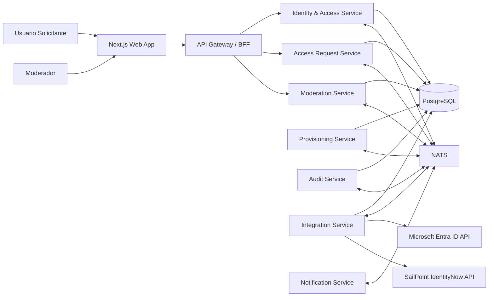

# Avaliação Técnica | Suzano/Thera Consulting | Visão Geral da Arquitetura

## Índice do conteúdo

<!-- TOC -->

- [Avaliação Técnica | Suzano/Thera Consulting | Visão Geral da Arquitetura](#avalia%C3%A7%C3%A3o-t%C3%A9cnica--suzanothera-consulting--vis%C3%A3o-geral-da-arquitetura)
    - [Índice do conteúdo](#%C3%ADndice-do-conte%C3%BAdo)
    - [Introdução](#introdu%C3%A7%C3%A3o)
        - [Princípios adotados](#princ%C3%ADpios-adotados)
        - [Componentes principais](#componentes-principais)
    - [Diagrama da arquitetura](#diagrama-da-arquitetura)
    - [O que deseja fazer?](#o-que-deseja-fazer)

<!-- /TOC -->

## Introdução 
A solução pode ser organizada em uma arquitetura modular orientada a eventos, mantendo consistência transacional local por serviço e propagando mudanças de estado via eventos de domínio publicados no NATS.

### Princípios adotados

- Fonte de verdade local: cada módulo mantém seu próprio modelo de domínio e persiste em PostgreSQL.
- Eventos de domínio: mudanças relevantes do negócio são emitidas como eventos.
- Integrações externas desacopladas: Microsoft Entra ID e SailPoint IdentityNow são consumidos por adaptadores/serviços de integração.
- Auditabilidade first-class: toda ação relevante gera registro auditável.
- Segurança por identidade e autorização: OAuth2 + JWT com claims de usuário, papéis e permissões.
- Idempotência e resiliência: consumidores de eventos devem tolerar reentrega e falhas temporárias.

### Componentes principais

Uma divisão prática seria:

| Componente                | Responsabilidade principal                                                |
|---------------------------|---------------------------------------------------------------------------|
| Next.js Web App           | UI, login, abertura de solicitação, tela de moderação, consulta de status |
| API Gateway / BFF         | Entrada HTTP principal, agregação de respostas, validação de JWT          |
| Identity & Access Service | Usuários, papéis, permissões, claims JWT, vínculo com Entra ID/SailPoint  |
| Access Request Service    | Gestão do ciclo de vida da solicitação de acesso                          |
| Moderation Service        | Regras e ações de aprovação/rejeição por moderadores                      |
| Provisioning Service      | Atribuição automática de função padrão e efetivação de acesso             |
| Integration Service       | Integrações com Microsoft Entra ID e SailPoint IdentityNow                |
| Audit Service             | Persistência e consulta de trilha de auditoria                            |
| Notification Service      | E-mails/notificações de status                                            |
| NATS                      | Broker de eventos e mensagens assíncronas                                 |
| PostgreSQL                | Persistência relacional                                                   |
| Observability Stack       | Logs estruturados, métricas, tracing                                      |

## Diagrama da arquitetura

Este diagrama mostra a visão macro dos componentes.

> **Observação**
> 
> - Assume-se aqui que, sempre que possível, as componentes da plataforma serão encapsuladas em um contêineres Docker, com imagens dedicadas;
> - O mecanismo de orquestração, a priori, não está definido, haja vista que isso é explorado na seção de escalabilidade.

---
## O que deseja fazer?
- [Voltar ao topo](#índice-do-conteúdo)
- [Voltar à raiz](../README.md)
- [Bounded contexts e serviços](./bounded-context-services-specs.md);
