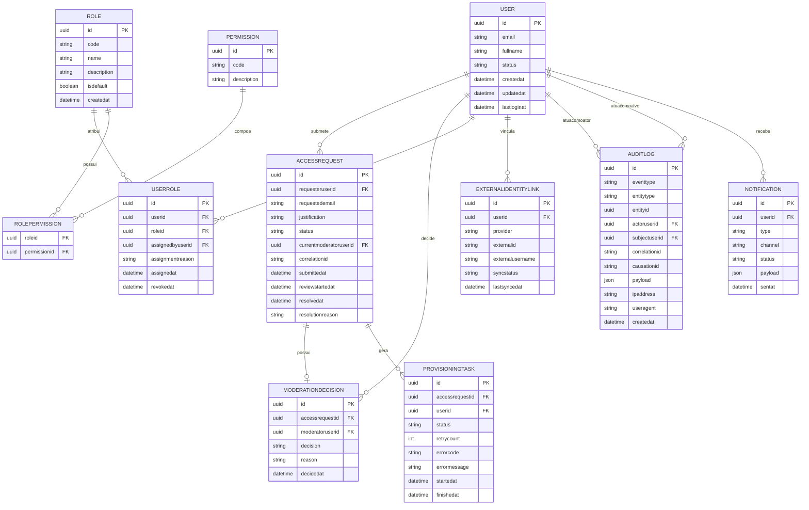

# Avaliação Técnica | Suzano/Thera Consulting | Entidades de Domínio

## Índice de conteúdo

<!-- TOC -->

- [Avaliação Técnica | Suzano/Thera Consulting | Entidades de Domínio](#avalia%C3%A7%C3%A3o-t%C3%A9cnica--suzanothera-consulting--entidades-de-dom%C3%ADnio)
    - [Índice de conteúdo](#%C3%ADndice-de-conte%C3%BAdo)
    - [Detalhamento](#detalhamento)
    - [Modelo entidade-relacionamento](#modelo-entidade-relacionamento)
        - [ER lógico sugerido](#er-l%C3%B3gico-sugerido)
    - [O que deseja fazer?](#o-que-deseja-fazer)

<!-- /TOC -->

## Detalhamento

A seguir, a descrição de cada entidade principal.

<table>
    <tr>
        <th>Nome da entidade</th>
        <th>Descrição</th>
        <th>Atributos principais</th>
        <th>Responsabilidades</th>
    </tr>
    <tr>
        <td>User</td>
        <td>Representa o usuário da plataforma, seja solicitante, moderador ou administrador.</td>
        <td>
            - id  
            - email  
            - fullName  
            - status (PENDINGACCESS, ACTIVE, REJECTED, BLOCKED, INACTIVE)  
            - createdAt  
            - updatedAt  
            - lastLoginAt  
        </td>
        <td>
            - identificar o ator principal do sistema;  
            - manter o estado de acesso;  
            - associar papéis e identidades externas.  
        </td>
    </tr>
    <tr>
        <td>ExternalIdentityLink</td>
        <td>Representa o vínculo do usuário com identidades em provedores externos.</td>
        <td>
            - id  
            - userId  
            - provider (ENTRAID, SAILPOINT)  
            - externalId  
            - externalUsername  
            - syncStatus  
            - lastSyncedAt  
        </td>
        <td>
            - relacionar identidade interna com identidades externas;;  
            - rastrear sincronização com Entra ID e SailPoint.  
        </td>
    </tr>
    <tr>
        <td>Role</td>
        <td>Representa uma função/perfil de acesso.</td>
        <td>
            - id  
            - code (ex.: BASICUSER, MODERATOR, ADMIN)  
            - name  
            - description  
            - isDefault  
            - createdAt  
        </td>
        <td>
            - Agrupar permissões;  
            - definir a função padrão atribuída após aprovação.  
        </td>
    </tr>
    <tr>
        <td>Permission</td>
        <td>Representa uma permissão atômica do sistema.</td>
        <td>
            - id  
            - code (ex.: accessrequest:approve)  
            - description  
        </td>
        <td>
            - Permitir autorização granular;  
            - Compor papéis.  
        </td>
    </tr>
    <tr>
        <td>RolePermission</td>
        <td>Entidade de associação entre papel e permissão.</td>
        <td>
            - roleId  
            - permissionId  
        </td>
        <td>
            - Mapear autorização baseada em RBAC.  
        </td>
    </tr>
    <tr>
        <td>UserRole</td>
        <td>Entidade de associação entre usuário e papel.</td>
        <td>
            - id  
            - userId  
            - roleId  
            - assignedByUserId  
            - assignmentReason  
            - assignedAt  
            - revokedAt  
        </td>
        <td>
            - Registrar atribuição de papéis;  
            - Manter evidência de quem concedeu o papel.  
        </td>
    </tr>
    <tr>
        <td>AccessRequest</td>
        <td>Representa a solicitação de acesso submetida pelo usuário.</td>
        <td>
            - id  
            - requesterUserId  
            - requestedEmail  
            - justification  
            - status  
            - submittedAt  
            - reviewStartedAt  
            - resolvedAt  
            - resolutionReason  
            - currentModeratorUserId  
            - correlationId  
        </td>
        <td>
            - centralizar o ciclo de vida da solicitação;  
            - armazenar contexto da análise;  
            - servir como raiz do agregado de solicitação.  
        </td>
    </tr>
    <tr>
        <td>ModerationDecision</td>
        <td>Representa a decisão formal do moderador sobre uma solicitação.</td>
        <td>
            - id  
            - accessRequestId  
            - moderatorUserId  
            - decision (APPROVED, REJECTED)  
            - reason  
            - decidedAt  
        </td>
        <td>
            - Registrar a decisão imutável do moderador;  
            - Garantir trilha auditável da análise.  
        </td>
    </tr>
    <tr>
        <td>ProvisioningTask</td>
        <td>Representa o processo de provisionamento disparado após aprovação.</td>
        <td>
            - id  
            - accessRequestId  
            - userId  
            - status (PENDING, INPROGRESS, COMPLETED, FAILED)  
            - startedAt  
            - finishedAt  
            - errorCode  
            - errorMessage  
            - retryCount  
        </td>
        <td>
            - Rastrear a execução técnica do provisionamento;  
            - Permitir retentativas e suporte operacional.  
        </td>
    </tr>
    <tr>
        <td>AuditLog</td>
        <td>Representa o registro auditável de uma operação.</td>
        <td>
            - id  
            - eventType  
            - entityType  
            - entityId  
            - actorUserId  
            - subjectUserId  
            - correlationId  
            - causationId  
            - payload  
            - createdAt  
            - ipAddress  
            - userAgent  
        </td>
        <td>
            - Registrar ações de negócio e integração;  
            - Suportar auditoria, investigação e compliance.  
        </td>
    </tr>
    <tr>
        <td>Notification</td>
        <td>Representa uma notificação a ser entregue ou já entregue.</td>
        <td>
            - id  
            - userId  
            - type  
            - channel  
            - status  
            - payload  
            - sentAt  
        </td>
        <td>
            - Comunicar mudança de status da solicitação;  
            - Manter evidência de entrega lógica.  
        </td>
    </tr>
</table>

> **Observação**
> 
> Concernente à entidade `Notification`, haja vista que não é necessariamente do escopo dessa investigação técnica já definir o tipo de serviço que irá prover o envio de notificações, e.g. servidor SMTP para e-mail, API do WhatsApp para notificações PUSH, são incluídos na entidade apenas os atributos que estabelecem um vínculo com quem está recendo, sendo o atributo `channel` assumido aqui como arbitrário para a posterio definição do canal de envio de notificações.

## Modelo entidade-relacionamento

Primeiro, a visão conceitual.

### ER lógico sugerido

Abaixo está uma forma de modelar as tabelas principais com cardinalidades mais claras.

| Entidade              | Relacionamentos principais                                                                 |
|-----------------------|--------------------------------------------------------------------------------------------|
| `Users`               | 1:N com `AccessRequests`, 1:N com `UserRoles` , 1:N com `ExternalIdentityLinks`            |
| `AccessRequests`      | N:1 com `Users` (requester), 1:0..1 com `ModerationDecisions`, 1:N com `ProvisioningTasks` |
| `ModerationDecisions` | N:1 com `accessrequests`, N:1 com `Users` (moderator)                                      |
| `Eoles`                 | 1:N com `UserRoles`, N:N com `Permissions` via ``RolePermissions`                       |
| `AuditLogs`             | N:1 com `Users` como ator e como alvo                                                  |
| `Notifications`         | N:1 com `Users`                                                                        |
| `ExternalIdentityLinks` | N:1 com `Users`                                                                        |

---

## O que deseja fazer?

- [Voltar ao topo](#índice-de-conteúdo)
- [Voltar à raíz](../README.md)
- [Fluxo de negócio](./event-oriented-flow-specs.md)
- [Casos de uso](./use-cases-specs.md)
