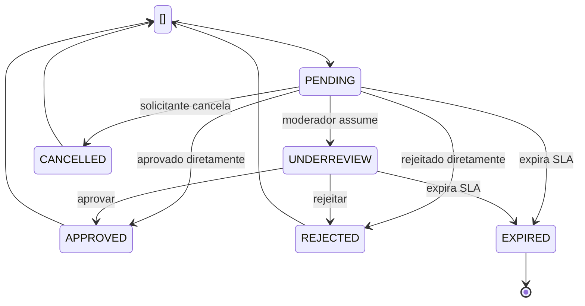

# Avaliação Técnica | Suzano/Thera Consulting | Fluxo de Negócio

## Índice de conteúdo

<!-- TOC -->

- [Avaliação Técnica | Suzano/Thera Consulting | Fluxo de Negócio](#avalia%C3%A7%C3%A3o-t%C3%A9cnica--suzanothera-consulting--fluxo-de-neg%C3%B3cio)
    - [Índice de conteúdo](#%C3%ADndice-de-conte%C3%BAdo)
    - [Introdução](#introdu%C3%A7%C3%A3o)
    - [Fluxo principal de aprovação](#fluxo-principal-de-aprova%C3%A7%C3%A3o)
    - [Fluxo principal de rejeição](#fluxo-principal-de-rejei%C3%A7%C3%A3o)
    - [Eventos de domínio sugeridos](#eventos-de-dom%C3%ADnio-sugeridos)
        - [Exemplo de payload de evento](#exemplo-de-payload-de-evento)
    - [Estratégias importantes para consistência](#estrat%C3%A9gias-importantes-para-consist%C3%AAncia)
        - [Outbox Pattern](#outbox-pattern)
        - [Idempotência](#idempot%C3%AAncia)
        - [Sagas / Process Manager](#sagas--process-manager)
    - [Modelo de autenticação e autorização](#modelo-de-autentica%C3%A7%C3%A3o-e-autoriza%C3%A7%C3%A3o)
        - [OAuth2 + JWT](#oauth2--jwt)
        - [Claims recomendadas](#claims-recomendadas)
        - [Permissões mínimas sugeridas](#permiss%C3%B5es-m%C3%ADnimas-sugeridas)
    - [Considerações sobre fluxos de eventos](#considera%C3%A7%C3%B5es-sobre-fluxos-de-eventos)
        - [Eventos assíncronos](#eventos-ass%C3%ADncronos)
        - [Estados da solicitação](#estados-da-solicita%C3%A7%C3%A3o)
        - [Eventos de domínio internos](#eventos-de-dom%C3%ADnio-internos)
        - [Eventos de integração](#eventos-de-integra%C3%A7%C3%A3o)
    - [O que deseja fazer?](#o-que-deseja-fazer)

<!-- /TOC -->


## Introdução

De posse do panorama arquitetônico e da modelagem das entidades principais que definem os diferentes domínios do sistemas, passamos agora a falar, de forma mais detalhada, do fluxo de negócio orientado à eventos.

## Fluxo principal de aprovação

- 1. Usuário autenticado ou pré-identificado inicia uma solicitação de acesso.
- 2. O Access Request Service valida regras básicas e grava a solicitação.
- 3. É emitido o evento AccessRequestSubmitted.
- 4. Moderation Service recebe o evento e disponibiliza a solicitação para moderadores.
- 5. Um moderador aprova a solicitação.
- 6. O Moderation Service persiste a decisão e publica AccessRequestApproved.
- 7. O Provisioning Service consome o evento e:
    - 7.1. Garante existência/vínculo do usuário;
    - 7.2. Atribui a função padrão;
    - 7.3. Opcionalmente sincroniza Entra ID / SailPoint.
- 8. Após sucesso, publica UserProvisioned e/ou DefaultRoleAssigned.
- 9. O Identity & Access Service atualiza o estado de acesso do usuário.
- 10. O Audit Service registra todo o encadeamento.
- 11. O Notification Service envia confirmação ao solicitante e, se necessário, ao moderador.

## Fluxo principal de rejeição
- 1. Solicitação fica pendente de moderação.
- 2. Moderador rejeita e informa motivo.
- 3. Moderation Service registra a decisão e publica AccessRequestRejected.
- 4. Access Request Service atualiza o status final.
- 5. Audit Service registra a rejeição.
- 6. Notification Service comunica o solicitante.

## Eventos de domínio sugeridos

Os eventos devem ser pequenos, versionados e carregarem IDs de correlação.

| Evento                         | Quando ocorre                               | Consumidores principais                  |
|--------------------------------|---------------------------------------------|------------------------------------------|
| AccessRequestSubmitted         | Solicitação criada                          | Moderation, Audit, Notification          |
| AccessRequestMarkedUnderReview | Solicitação assumida para análise           | Audit                                    |
| AccessRequestApproved          | Moderador aprovou                           | Provisioning, Audit, Notification        |
| AccessRequestRejected          | Moderador rejeitou                          | Access Request, Audit, Notification      |
| UserProvisioningStarted        | Provisionamento iniciado                    | Audit                                    |
| DefaultRoleAssigned            | Função padrão atribuída                     | Identity & Access, Audit                 |
| ExternalIdentitySynchronized   | Sincronização com Entra/SailPoint concluída | Audit                                    |
| UserProvisioned                | Usuário pronto para acesso                  | Identity & Access, Notification, Audit   |
| ProvisioningFailed             | Falha no provisionamento                    | Audit, Notification, suporte operacional |
| AuditLogRequested              | Opcional, para pipeline de auditoria        | Audit                                    |

### Exemplo de payload de evento

```json
{
  "eventId": "evt01JXYZ...",
  "eventType": "AccessRequestApproved",
  "eventVersion": 1,
  "occurredAt": "2026-06-15T13:45:00Z",
  "correlationId": "corr01JXYZ...",
  "causationId": "cmd01JXYZ...",
  "actor": {
    "userId": "usrmod123",
    "type": "MODERATOR"
  },
  "subject": {
    "userId": "usrreq999"
  },
  "data": {
    "accessRequestId": "ar456",
    "decisionId": "md789",
    "approvedBy": "usrmod123",
    "defaultRoleCode": "BASICUSER"
  }
}
```

## Estratégias importantes para consistência

### Outbox Pattern

Como há PostgreSQL e NATS, recomendo fortemente usar Transactional Outbox:

- 1. A transação grava:
  - 1.1. A mudança de estado da entidade;
  - 1.2. O registro na tabela outboxevents.
- 2. Um publicador assíncrono lê a outbox e publica no NATS.
- 3. Após sucesso, marca o evento como publicado.

Isso evita o problema clássico de:

- 1. Gravar no banco e falhar ao publicar no broker;
- 2. Publicar no broker e falhar ao gravar no banco.

### Idempotência

Consumidores devem registrar eventid processados em tabela própria, por exemplo:

- 1. messageconsumption
- 2. chave única por consumername + eventid

Assim, reprocessemento não duplica:

- 1. Atribuição de papéis;
- 2. Criação de logs;
- 3. Chamadas externas.

### Sagas / Process Manager

Para a parte de provisionamento, faz sentido um process manager simples:

- 1. disparado por AccessRequestApproved;
- 2. acompanha:
  - 2.1. criação/ativação do usuário;
  - 2.2. atribuição da função padrão;
  - 2.3. sincronização com Entra ID;
  - 2.4. sincronização com SailPoint;
- 3. conclui com UserProvisioned ou ProvisioningFailed.

## Modelo de autenticação e autorização

### OAuth2 + JWT

O fluxo pode ser:

- 1. Autenticação do usuário por Microsoft Entra ID como provedor de identidade;
- 2. Backend valida o token recebido;
- 3. Plataforma emite ou enriquece uma sessão/token próprio com claims internas, se necessário;
- 4. Autorização baseada em:
  - 4.1. sub
  - 4.2. email
  - 4.3. roles
  - 4.4. permissions
  - 4.5. tenant se existir multi-tenant
  - 4.6. moderator=true ou permissão específica.

### Claims recomendadas

```json
{
  "sub": "usr123",
  "email": "user@empresa.com",
  "roles": ["BASICUSER"],
  "permissions": [
    "accessrequest:create",
    "accessrequest:read:self"
  ],
  "externalIds": {
    "entraObjectId": "xxxx",
    "sailpointIdentityId": "yyyy"
  },
  "iat": 1710000000,
  "exp": 1710003600,
  "iss": "plataforma.exemplo",
  "aud": "plataforma-web"
}
```

### Permissões mínimas sugeridas

| Papel     | Permissões                                                          |
|-----------|---------------------------------------------------------------------|
| REQUESTER | accessrequest:create, accessrequest:read:self                       |
| MODERATOR | accessrequest:read:any, accessrequest:approve, accessrequest:reject |
| BASICUSER | permissões básicas da plataforma após aprovação                     |
| ADMIN     | gestão de papéis, políticas, auditoria avançada                     |

## Considerações sobre fluxos de eventos

No momento em que os casos de uso estiverem sendo executados, vários tipos eventos serão engatilhados pelas diferentes ações logicamente encadeadas de modo a requisitar acessos, moderar requisições ou provisionar acessos e perfis de identidade. O que segue agora é uma proposta de definição desses eventos e seus associados estados, assim como das transições de um estado para outro.

### Eventos assíncronos

- AccessRequestSubmitted
- AccessRequestApproved
- AccessRequestRejected
- DefaultRoleAssigned
- UserProvisioned
- ProvisioningFailed

### Estados da solicitação

Este diagrama de estados ajuda a visualizar o ciclo de vida de AccessRequest.



De modo a não poluir o núcleo do domínio com detalhes de infraestrutura externa, segue as seguintes sugestões para separação entre eventos de domínio e eventos de integração

### Eventos de domínio internos

Usados entre módulos da própria plataforma:

- AccessRequestSubmitted
- ModerationDecisionRecorded
- DefaultRoleAssigned
- UserProvisioned

### Eventos de integração

Usados para efeitos externos ou interoperabilidade:

- EntraIdentitySyncRequested
- EntraIdentitySynchronized
- SailPointProvisioningRequested
- SailPointProvisioningCompleted

--- 

## O que deseja fazer?

- [Voltar ao topo](#índice-de-conteúdo)
- [Voltar à raíz](../main.md)
- [Bounded contexts e serviços](./bounded-context-services-specs.md)
- [Entidades de domínio](domain-entities-specs.md)