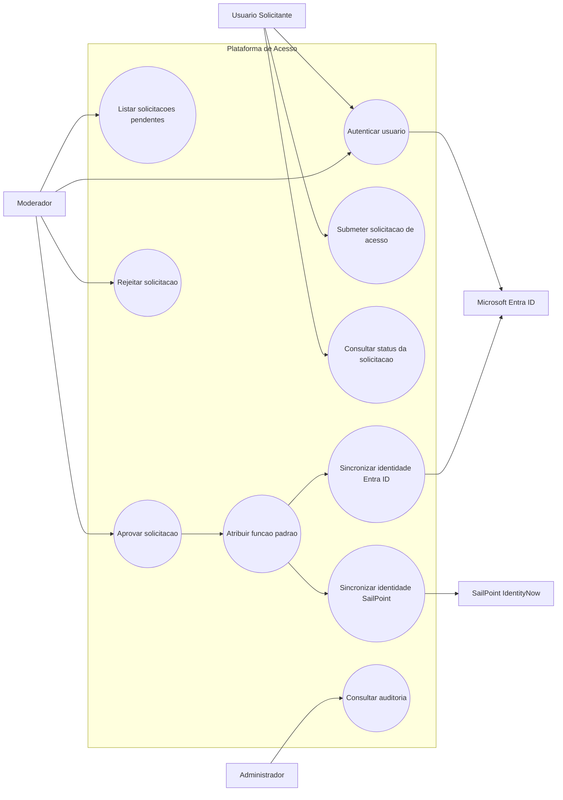
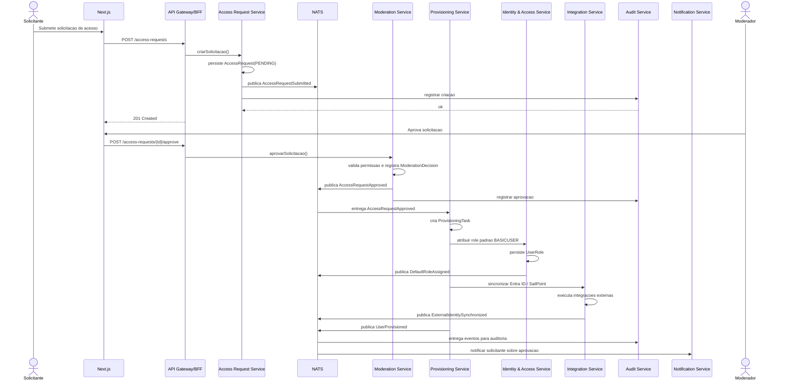
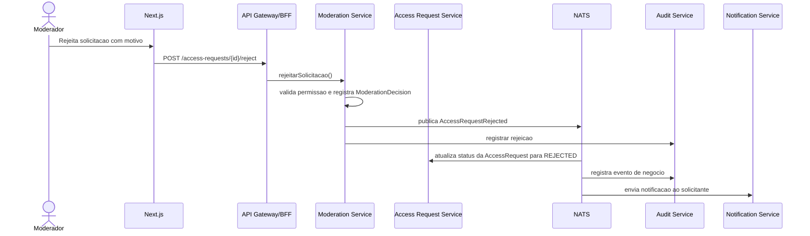

# Avaliação Técnica | Suzano/Thera Consulting | Regras de Negócio

## Índice de conteúdo

<!-- TOC -->

- [Avaliação Técnica | Suzano/Thera Consulting | Regras de Negócio](#avalia%C3%A7%C3%A3o-t%C3%A9cnica--suzanothera-consulting--regras-de-neg%C3%B3cio)
    - [Índice de conteúdo](#%C3%ADndice-de-conte%C3%BAdo)
    - [Regras de negócio essenciais](#regras-de-neg%C3%B3cio-essenciais)
        - [Regras de solicitação](#regras-de-solicita%C3%A7%C3%A3o)
        - [Regras de moderação](#regras-de-modera%C3%A7%C3%A3o)
        - [Regras de provisionamento](#regras-de-provisionamento)
        - [Regras de auditoria](#regras-de-auditoria)
    - [Casos de uso](#casos-de-uso)
        - [Principais casos de uso do sistema](#principais-casos-de-uso-do-sistema)
        - [Diagrama de casos de uso](#diagrama-de-casos-de-uso)
    - [Diagramas de sequência](#diagramas-de-sequ%C3%AAncia)
        - [Aprovação da solicitação](#aprova%C3%A7%C3%A3o-da-solicita%C3%A7%C3%A3o)
        - [Rejeição da solicitação](#rejei%C3%A7%C3%A3o-da-solicita%C3%A7%C3%A3o)
    - [O que deseja fazer?](#o-que-deseja-fazer)

<!-- /TOC -->

## Regras de negócio essenciais

### Regras de solicitação

- Um usuário não deve possuir mais de uma solicitação pendente ao mesmo tempo.
- Solicitações devem ter justificativa mínima.
- E-mail do solicitante deve ser válido e, idealmente, compatível com domínio permitido.

### Regras de moderação

- Apenas usuários com permissão `accessrequest:approve` ou `accessrequest:reject` podem decidir.
- Moderador não pode aprovar a própria solicitação, se isso for política da organização.
- Toda rejeição deve conter motivo.
- Decisão de moderação é final para aquela solicitação, salvo reabertura explícita.

### Regras de provisionamento

- Aprovação deve disparar atribuição da função padrão exatamente uma vez.
- Atribuição de papel deve ser idempotente.
- Falha em integração externa não deve corromper o estado interno; deve gerar estado compensável ou pendência operacional.

### Regras de auditoria

- Toda ação crítica deve gerar log:
    - Criação de solicitação;
    - Início de análise;
    - Aprovação;
    - Rejeição;
    - Atribuição de papel;
    - Sincronização externa;
    - Falhas.

## Casos de uso

### Principais casos de uso do sistema

- UC1: Autenticar usuário
- UC2: Submeter solicitação de acesso
- UC3: Consultar status da solicitação
- UC4: Listar solicitações pendentes para moderação
- UC5: Aprovar solicitação
- UC6: Rejeitar solicitação
- UC8: Atribuir função padrão automaticamente
- UC9: Sincronizar identidade com Entra ID
- UC10: Sincronizar identidade com SailPoint IdentityNow
- UC11: Consultar trilha de auditoria

### Diagrama de casos de uso

## Diagramas de sequência

### Aprovação da solicitação

### Rejeição da solicitação

---

## O que deseja fazer?

- [Voltar ao topo](#índice-de-conteúdo)
- [Voltar à raíz](../README.md)
- [Entidades de domínio](./domain-entities-specs.md)
- [Análise de risco](./risk-assessment-specs.md)